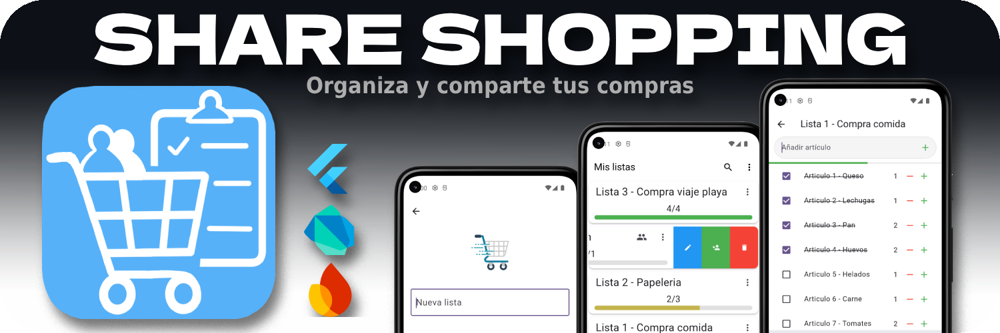
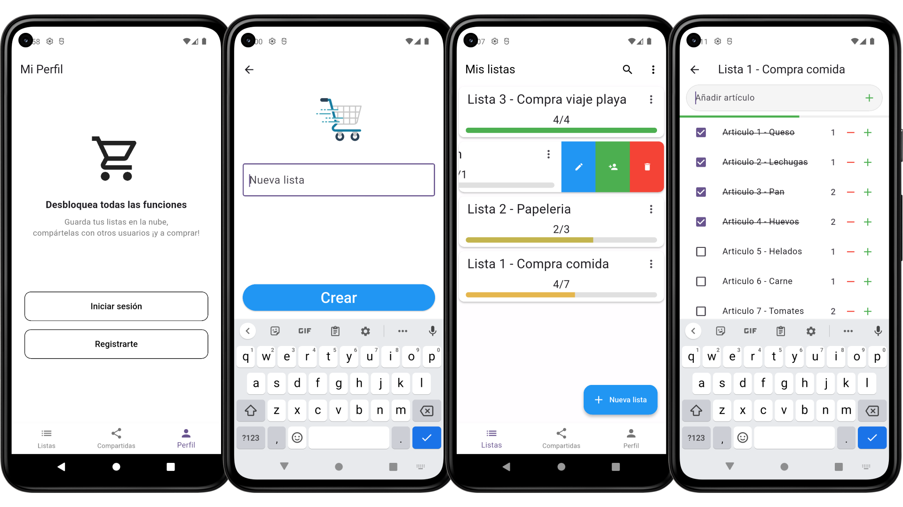
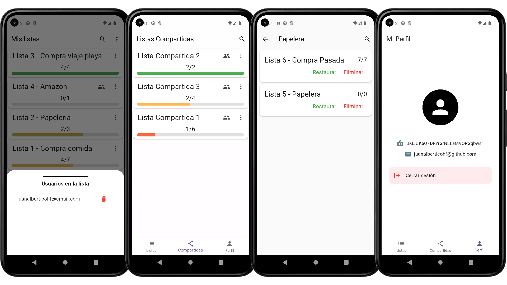

# ShareShopping

- [Funcionalidades principales](#funcionalidades)
- [Tecnologias proyecto](#tecnologias)
- [Características técnicas](#caracteristicas)
- [Instalación](#instalacion)
- [Galeria de imagenes](#galeria)
- [Variables de entorno](#variables-de-entorno)

---



**Share Shopping** es una aplicación movil de creación de listas de compras individual o colaborativas, con la posibilidad de compartirlas con otros usuarios de la aplicación y administrarlas en tiempo real. Disponible solamente para Android.

La premisa es que el usuario pueda crear todo tipo de listas y a su vez cooperar en cualquier otra
creada por otro usuario, además de ser totalmente funcional sin depender de la conexión
permitiendo un uso cómodo y permitiendo acceder a su información en cualquier dispositivo, ya
que toda la información se almacena en la nube.

ShareShopping conforma el proyecto final de curso (TFG) del grado superior de desarrollo de 
aplicaciones multiplataforma (DAM), involucrando en mayor medida al modulo de programación 
multimedia y dispositivos moviles.

## FUNCIONALIDADES
ShareShopping ofrece las siguientes funcionalidades:
- **Autentificación basica de usuarios** (registro, inicio de sesión, cierre de sesión).
- **Creación y gestion de listas de compras** (añadir, eliminar, editar).
- **Creación y gestión de articulos dentro de una lista** (añadir, marcar/desmarcar, eliminar).
- **Compartir listas con otros usuarios de la aplicación.**
- **Administración de la papelera de reciclaje para recuperar listas eliminadas**.
- **Sincronización en tiempo real de las listas compartidas**.
- **Funcionalidad offline para acceder a las listas sin conexión a internet**.

## TECNOLOGIAS
ShareShopping se ha desarrollado utilizando las siguientes tecnologías:
- **Lenguaje de programación**: `Dart`
- **Framework (UI)**: `Flutter`
- **Base de datos**: `Firebase Firestore`
- **Autenticación**: `Firebase Authentication`
- **Gestor de versiones**: `Git`
- **Repositorio**: `GitHub`

## CARACTERISTICAS

Aqui se detallan las características técnicas del proyecto de ShareShopping:

- **Versión proyecto**: `1.0.0`
- **Plataforma**: `Android 12 o superior`
- **IDE**: `Android Studio Panda 1 | 2025.3.1 Patch 1`
- **Versión Flutter**: `3.32.0 (Stable)`
- **Versión Dart**: `3.8.0`
- **Versión DevTools**: `2.45.1`

## INSTALACION
Para instalar ShareShopping en tu dispositivo Android, sigue estos pasos:
1. **Descarga el archivo APK de ShareShopping** en la sección de releases de este repositorio.
2. **Accede al gestor de archivos de tu dispositivo movil** y navega hasta la carpeta descargar o donde 
hayas guardado el archivo APK.
3. **Toca el archivo APK para iniciar la instalación.** Es posible que debas habilitar la opción de
"Instalar aplicaciones de fuentes desconocidas" en la configuración de tu dispositivo.
4. **Sigue las instrucciones en pantalla para completar la instalación.**
5. **Una vez instalada, abre la aplicación y regístrate o inicia sesión para comenzar a crear tus 
listas de compras.**

## GALERIA
- Panel de autentificación, creación de listas, listas del usuario y gestion, y lista de articulos:


- Gestion de usuarios de una lista compartida, panel listas compartidas, papelera de reciclaje y 
perfil de usuario:



## VARIABLES DE ENTORNO
Para ejecutar ShareShopping en Android Studio es necesario crear un archivo `env.json` en la raíz
del proyecto definiendo las variables de entorno necesarias para la conexión con Firebase. 
El contenido del archivo debe ser el siguiente:

```json
{
  "ANDROID_API_KEY": "tu_android_api_key",
  "ANDROID_API_ID": "tu_android_api_id",
  "ANDROID_MESSAGING_SENDER_ID": "tu_android_messaging_sender_id",
  "ANDROID_PROJECT_ID": "tu_android_project_id",
  "ANDROID_STORAGE_BUCKET": "tu_android_storage_bucket",
  "IOS_API_KEY": "tu_ios_api_key",
  "IOS_API_ID": "tu_ios_api_id",
  "IOS_MESSAGING_SENDER_ID": "tu_ios_messaging_sender_id",
  "IOS_PROJECT_ID": "tu_ios_project_id",
  "IOS_STORAGE_BUCKET": "tu_ios_storage_bucket",
  "IOS_BUNDLE_ID": "tu_ios_bundle_id"
}
```

Asegúrate de reemplazar los valores con las credenciales de tu proyecto de Firebase para Android e iOS.

Para ejecutar el proyecto correctamente asegurate añadir el parametro `--dart-define-from-file=env.json` 
al ejecutar la aplicación. A continuación un comando para ejecutar el comando desde terminal:

```bash
flutter run --dart-define-from-file=env.json
```

